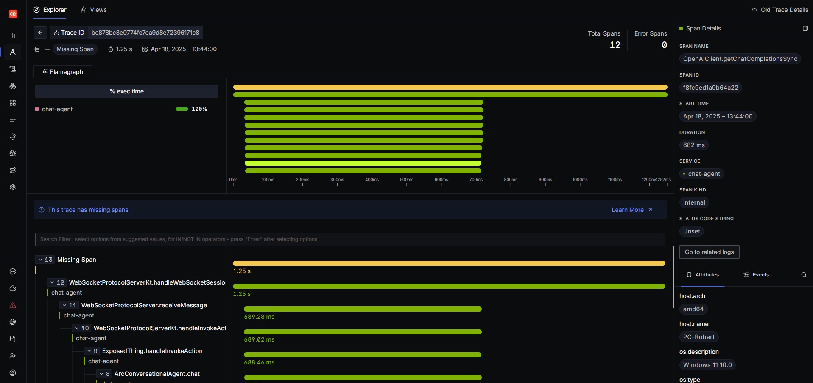

# Template Project for LMOS SDK Agent

This is a Gradle template project designed to quickly create an Agent based on the LMOS Server SDK.

## Getting Started

1. **Clone the Repository**: Clone this repository to your local machine.
2. **Open in IDE**: Open the project in your favorite IDE (e.g., IntelliJ IDEA, VSCode).
3. **Configure the Agent**: Modify the `src/main/resources/application.yml` file to configure the ARC client. 
4. **Run the Agent**: After building, you can run the agent using the following command:
   ```bash
    ./gradlew bootRun
    ```
5. **Access the Agent**: Open your web browser and navigate to `http://localhost:8181/chatagent` to access the agent's description.
6. **Install SigNoz for Telemetry**: Follow the [Installation guide](https://signoz.io/docs/install/docker/#install-signoz-using-docker-compose)
   You should point your browser to http://localhost:3301/
7. **Run test**: After installing SigNoz, you can run the test using the following command:
   ```bash
   ./gradlew test --tests "org.eclipse.lmos.template.LocalAgentApplicationTest"
   ```
8. **View Telemetry**: After running the test, you can view the telemetry data in SigNoz. Navigate to the "Traces" section.
9. **View Logs**: You can view the logs in the "Logs" section of SigNoz. 



10. **Create image**: You can create an image using the following command:
    ```bash
   ./gradlew bootBuildImage --imageName=lmos/lmos-kotlin-sdk-template:0.0.1-SNAPSHOT
    ```
    It will build an image called `docker.io/lmos/lmos-kotlin-sdk-template:0.0.1-SNAPSHOT`